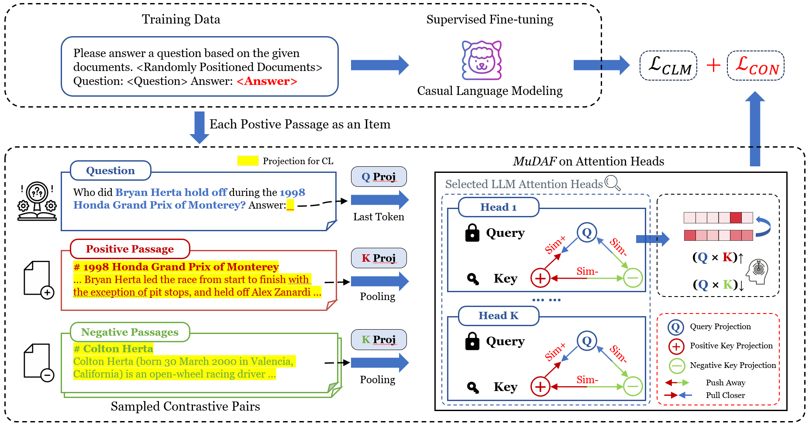

# MuDAF

This is the official repo for our paper ["MuDAF: Long-Context Multi-Document Attention Focusing through Contrastive Learning on Attention Heads"](https://arxiv.org/abs/2502.13963).

## Introduction

Long-context LLMs (LCLMs) can be easily distracted by irrelevant context, making them unable to fully utilize their long-context capabilities. How can we make them more focused?

In this work, we identify retrieval heads in multi-document question answering (MDQA), which can attend to golden passages for a given question and show patterns different from those found in the Needle-in-a-Haystack (NIAH) test.

Our method can explicitly enhance the retrieval capabilities of models' attention heads, making them more focused in MDQA. Our experiments show great potential in utilizing contrastive learning to adjust the attention distribution of some specific attention heads.

<!-- Stay tuned for more content! -->

<!-- ## Run

### Attention Visualization for MDQA

### Retrieval Scores Calculation

Download LongBench datasets [here], 

### Fine-tuning

### Evaluation

-->